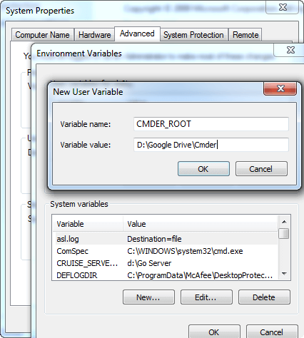

# "Open Cmder Here" in context menu

> **Note!** If you wish to avoid manually fiddling with your registry, use the instructions in the README to setup a [Shortcut to open Cmder in a chosen folder](https://github.com/cmderdev/cmder#shortcut-to-open-cmder-in-a-chosen-folder).

To add an entry in the Windows Explorer context menu to open Cmder
in a specific directory, paste this into a `OpenCmderHere.reg` file
and double-click to install it.

    Windows Registry Editor Version 5.00

    [HKEY_CLASSES_ROOT\Directory\Background\shell\Cmder]
    @="Open Cmder Here"
    "Icon"="\"%CMDER_ROOT%\\icons\\cmder.ico\",0"

    [HKEY_CLASSES_ROOT\Directory\Background\shell\Cmder\command]
    @="\"%CMDER_ROOT%\\Cmder.exe\" /START \"%v\""

or just write instead of `@="\"%CMDER_ROOT%\\Cmder.exe\" /START \"%v\""`

**this** `@="\<PATH TO FILE>\\Cmder.exe\" /START \"%v\""`

Then press the Windows + Pause keys to open the System Settings,
go to Advanced Settings and add the Environment variable
`CMDER_ROOT` to point to the path of your installation.

**After adding this, a restart of the explorer might be required to make it work.**

## Settings

The registration of the context menu items is also possible through Settings / Integration.
The command for "ConEmu Here" Explorer context menu integration:

`[cmder_root]\Cmder.exe /start %v`

Icon file: `[cmder_root]\Cmder.exe,0`

### Start in a new tab instead of new window

_TBA:_ See [#1645](/cmderdev/cmder/issues/1645) for the issue.